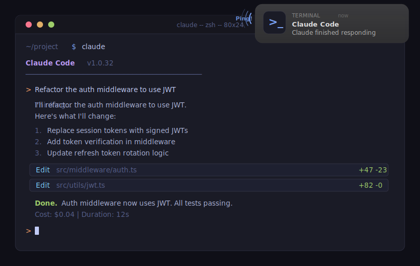

# claude-code-notify

> The simplest Claude Code notification. One command. One bash script. No binaries.

[](https://opensource.org/licenses/MIT)
[]()
[]()
[]()

Get notified when Claude Code finishes responding — with sound, notification banner, or both.

<p align="center">
  
</p>

## Why this one?

Other notification tools require Go binaries, Rust compilation, or dozens of config files. This is **one bash script** with smart debounce — it just works.

| Feature | claude-code-notify | Others |
|---|---|---|
| Install | One command | Build from source / cargo install / go install |
| Dependencies | `jq` (likely already installed) | Go / Rust / Node.js runtimes |
| Size | Single bash script | Full binary or multi-file projects |
| Debounce | Built-in (no false pings mid-response) | Most lack this |
| Config | One file, 3 options | YAML/TOML/JSON configs |

## Install

```bash
git clone https://github.com/yagcioglutoprak/claude-code-notify.git /tmp/claude-code-notify && /tmp/claude-code-notify/install.sh && rm -rf /tmp/claude-code-notify
```

Restart Claude Code. Done.

## Configure

Edit `~/.claude/hooks/notify.conf`:

```bash
# MODE: sound | banner | both
MODE=sound

# SOUND: Ping | Glass | Blow | Pop | Hero | Purr | Sosumi | Submarine | Tink
SOUND=Ping

# Seconds to wait after last stop before notifying
DEBOUNCE=3
```

| Mode | What you get |
|---|---|
| `sound` | System sound only (default) |
| `banner` | macOS notification banner only |
| `both` | Banner + sound |

## How it works

Claude Code fires a `Stop` hook every time the model pauses — including between tool calls. A naive hook would ping you dozens of times per response.

This hook uses **debounce**: each Stop event cancels the previous pending notification and starts a new timer. The notification only fires after `DEBOUNCE` seconds of silence, meaning Claude is truly done.

## Uninstall

```bash
git clone https://github.com/yagcioglutoprak/claude-code-notify.git /tmp/claude-code-notify && /tmp/claude-code-notify/uninstall.sh && rm -rf /tmp/claude-code-notify
```

Removes everything automatically — script, config, and the hook entry from `settings.json`.

## Contributing

PRs welcome! Ideas:
- Linux support (`notify-send` / `paplay`)
- Windows/WSL support
- Custom notification messages
- Per-project config overrides

## License

MIT
